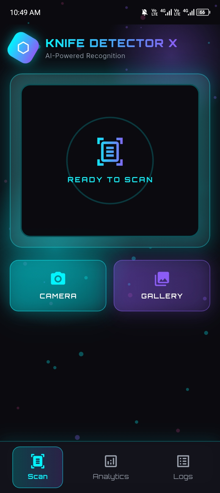
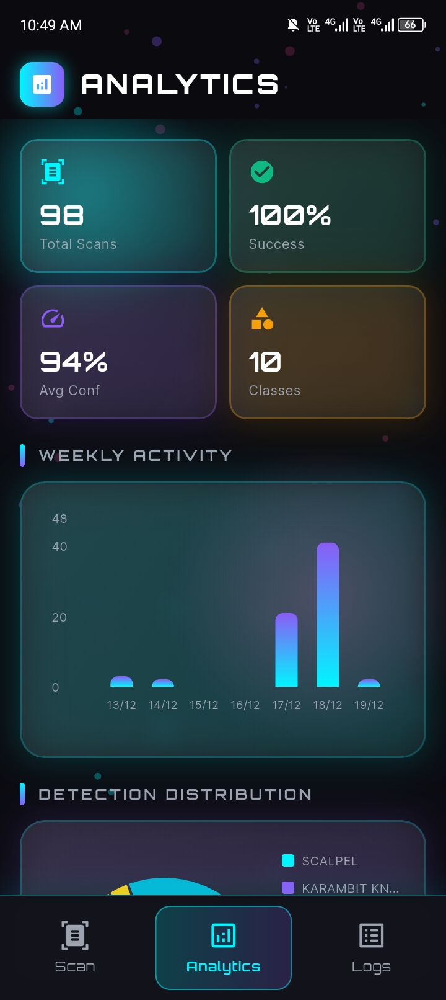
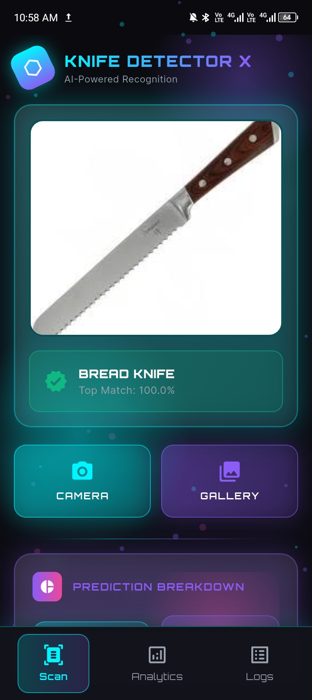
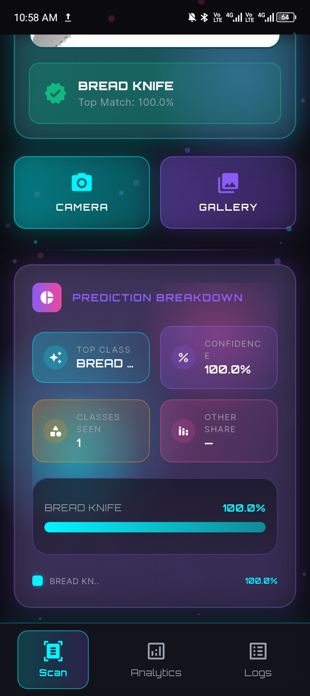

---

### 👨‍💻 Kitchie Awitan Bersabal  
**IT Student · Flutter & Web Developer · AI/ML Enthusiast**

---

## 🚀 About Me

I'm **Kitchie**, an **IT student** who loves learning by building real projects.  
I enjoy working with **Flutter**, **web technologies**, **AI/ML**, and **databases**, and I use GitHub to track my growth as a developer.

- 🌱 Currently improving my **Flutter UI**, **AI/ML integration**, and **full-stack development skills**
- 🧩 I like breaking big problems into small, clear steps
- 🎯 Long‑term goal: become a **full‑stack developer** who can build and deploy complete apps with AI capabilities

---

## 🧰 Skills and Technologies

### Programming Languages

### Frontend Development

### Backend & Database

### Mobile Development

### AI/ML & Tools

---

## 🔪 Knife Detector X - AI-Powered Classification App

My featured mobile project is **Knife Detector X**, built with **Flutter** and a **TensorFlow Lite model**.

- **Purpose**: Help users identify and classify different types of knives quickly using their phone.
- **Core Features**:
  - 📷 **Scan & Identify** knife types from photos using AI
  - 🧠 **On‑device ML model** using `.tflite` and `labels.txt` (11 knife classes)
  - 📊 **Analytics Dashboard** with charts and statistics
  - 📝 **History & Logs** to review previous scans
  - ☁️ **Firebase Cloud Sync** for data backup
  - 🎨 **Modern, neon-themed UI** with smooth animations

---

## 🖼️ App Screens (UI Preview)

| Scan & Detection | Analytics Dashboard | Scan History |
|:----:|:----:|:---------:|
|  |  |  |
|  |  |  |
|  | | |

---

## 🔪 Knife Classification Classes

| Knife Type | Description |
|:-----|:------------|
| **Boning Knife** | A **flexible, narrow blade** designed for removing bones from meat, ideal for precise cutting tasks. |
| **Karambit Knife** | A **curved, claw-like blade** with origins in Southeast Asia, known for its unique design and versatility. |
| **Hunting Knife** | A **robust, durable blade** built for outdoor use, field dressing, and survival situations. |
| **Machete** | A **large, broad blade** used for cutting through vegetation, agricultural work, and heavy-duty tasks. |
| **Pocket Knife** | A **compact, foldable blade** perfect for everyday carry, utility tasks, and portability. |
| **Scalpel** | A **precise, surgical blade** used in medical procedures, requiring extreme accuracy and sharpness. |
| **Throwing Knife** | A **balanced, aerodynamic blade** designed specifically for throwing sports and competitions. |
| **Bread Knife** | A **serrated blade** with saw-like teeth, perfect for cutting bread and delicate pastries without crushing. |
| **Santoku Knife** | A **Japanese-style all-purpose knife** with a shorter, wider blade, excellent for slicing, dicing, and mincing. |
| **Kukri** | A **distinctive curved blade** from Nepal, known for its unique shape and traditional use in various applications. |

---

## 💼 Other Featured Projects

| Project | Description | Tech Stack | Repository |
|:--------|:------------|:-----------|:-----------|
| **Flutter UI Components** | Reusable Flutter widgets and UI components with scanning, analytics, and log management features | `Flutter` `Dart` | [View Repo](https://github.com/kitchiebersabal263-sketch/Flutter_Widget_UIComponents) |
| **MySQL Trigger Implementation** | Database automation project implementing MySQL triggers for data management | `MySQL` `Database` | [View Repo](https://github.com/kitchiebersabal263-sketch/mysql-trigger-implementation-Bersabal) |
| **Bersabal_IT120_Act1** | Python programming activities and exercises for IT120 | `Python` | [View Repo](https://github.com/kitchiebersabal263-sketch/Bersabal_IT120_Act1) |
| **BERSABAL_IT108_ACTIVITIES** | Web development activities and fundamentals | `HTML` `CSS` `JavaScript` | [View Repo](https://github.com/kitchiebersabal263-sketch/BERSABAL_IT108_ACTIVITIES) |
| **CSC106_FinalProject** | Academic final project showcasing full-stack development skills | `Multiple Technologies` | [View Repo](https://github.com/kitchiebersabal263-sketch/CSC106_FinalProject) |

---

## 📊 GitHub Stats

<!-- Main stats -->

<!-- Top languages -->

---

## 🎯 Learning Roadmap

- 📱 Build more **Flutter** apps with better navigation and state management  
- 🤖 Improve **AI/ML integration** with TensorFlow Lite and model optimization  
- ☁️ Connect apps to **Firebase** (auth, real-time database, and cloud functions)  
- 🌐 Improve **responsive web design** and UI/UX  
- 🗄️ Practice **database design** and more complex SQL queries  
- 🚀 Deploy and publish **production-ready applications**

---

✨ **Thanks for visiting my profile!**  
Feel free to explore my repositories and follow my journey:  
👉 [github.com/kitchiebersabal263-sketch](https://github.com/kitchiebersabal263-sketch)

